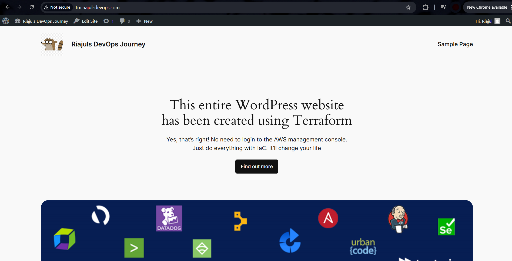

# Automated Wordpress Deployment with Terraform

This project uses Terraform to deploy a WordPress server on AWS and create a DNS `A` record in Cloudflare to point a subdomain (e.g., `tm.mydomain.com`) to the EC2 instance's public IP.

## 🧱 Infrastructure Components

- **AWS EC2 Instance**: Ubuntu instance with Apache, PHP, MySQL, and WordPress installed via `user_data`.
- **AWS Security Group**: Allows HTTP (80) and SSH (22) from anywhere.
- **Cloudflare DNS Record**: Creates an `A` record to map the subdomain (`tm`) to the EC2 public IP.

## 📁 Project Structure

├── main.tf
├── provider.tf
├── modules/
│ └── resources.tf
│ └── provider.tf
│ └── variables.tf
└── README.md

## ⚙️ Prerequisites

- Terraform v1.5+
- AWS credentials configured (`~/.aws/credentials` or environment variables)
- Cloudflare API Token with DNS Edit permission
- An existing hosted zone in Cloudflare for your domain (e.g., `mydomain.com`)

## 🚀 Usage

1. **Configure Backend (if using S3)**  
   Update `provider.tf` with your S3 backend settings.

2. **Update Variables**
   Modify `variables.tf` and `locals` in `resources.tf`:
   - `ami`: Change to a valid Ubuntu AMI in your region
   - `zone_id`: Cloudflare Zone ID for your domain

3. **Initialize Terraform**

   `terraform init`

4. **Plan the Deployment**

    `terraform plan`

5. **Apply the Deployment**

    `terraform apply`

5. **Check the Deployment**

    You should now be able to access your WordPress website and make any customisations should you want such as the below
    
    

6. **Destroy the Deployment**

    Once you are done, you can destroy your infrastructure using `terraform destroy`

## ✅ Conclusion
By completing this project, you have:

- Gained hands-on experience provisioning cloud infrastructure using Terraform.
- Learned how to deploy a fully functional WordPress stack on AWS EC2 with necessary software via user_data.
- Created and managed security groups to control access to your instance.
- Automated DNS configuration using the Cloudflare provider to point a subdomain to a dynamic IP.
- Gained an understanding of provider sourcing and modular structure in Terraform.
- Integrated multiple cloud services (AWS and Cloudflare) into a single declarative configuration.

This project lays a solid foundation for infrastructure as code (IaC) practices and serves as a valuable stepping stone toward building more complex, production-ready systems.